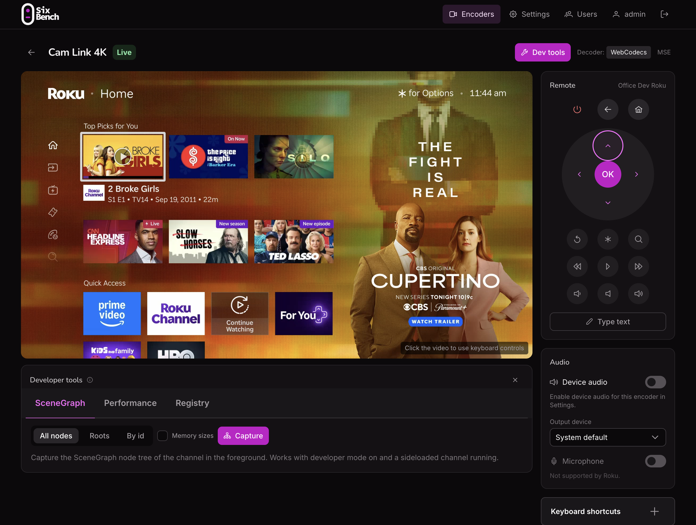
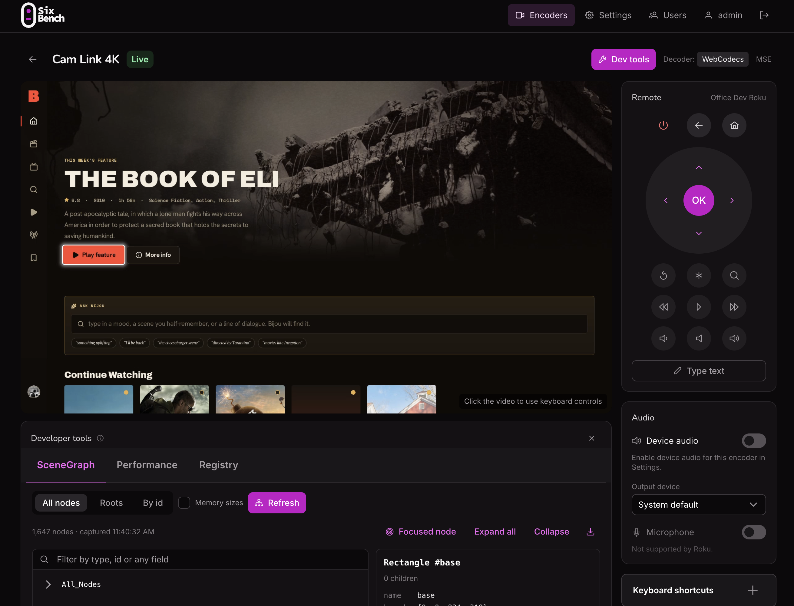

<p align="center">
  <picture>
    <source media="(prefers-color-scheme: dark)" srcset="web/public/brand/sixbench-dark.svg">
    
  </picture>
</p>

# SixBench

Watch and control a physical Roku from a web browser.



SixBench is a .NET 10 server with a Nuxt 4 web app. It captures a Roku's HDMI output through an HDMI-to-USB capture encoder (an Elgato Cam Link 4K or a generic MS2109 dongle, for example) and streams it to the browser with low latency. It sends remote-control commands back to the Roku over the network.

- **Live video in the browser.** H.264 is decoded with WebCodecs, typically well under a second behind the TV.
- **Remote control.** On-screen remote, keyboard shortcuts and text entry, sent with the Roku External Control Protocol (ECP).
- **Several encoders, several Rokus.** Pick an encoder from a list. Each one is linked to the Roku plugged into it.
- **Roku discovery.** Rokus on the LAN are found automatically (SSDP), or you can add one by IP address.
- **Device audio (optional).** The Roku's sound is streamed as Opus over the same connection.
- **Screenshots.** Save the current frame as a full-resolution PNG, from any channel.
- **Developer tools.** Sideload a channel zip, follow the BrightScript debug console, and package a signed `.pkg`, all through the server. Inspect the running channel's SceneGraph node tree, watch its CPU and memory use live, and read its registry (needs developer mode on the Roku).
- **Cross-platform.** Runs on Windows, macOS and Linux.

## How it works

```
             HDMI                    USB
  Roku ───────────────▶ Capture ─────────────▶ SixBench server
   ▲                    encoder                 │  ffmpeg → H.264 (+ Opus)
   │                                            │
   │  ECP over HTTP :8060                       │  WebSocket (binary frames)
   │  (keys, text)                              ▼
   └──────────────────────────────────── Browser: WebCodecs → <canvas>
```

1. The server lists the capture devices on the host. It uses ffmpeg's AVFoundation (macOS), DirectShow (Windows) or V4L2/ALSA (Linux) device lists.
2. When someone opens an encoder, the server starts **one** ffmpeg process for it, because USB capture devices allow only a single reader. ffmpeg encodes low-latency H.264, and the server sends each frame to every connected viewer.
3. The browser decodes the frames with WebCodecs and draws them on a canvas. A Media Source Extensions fallback is also available.
4. Remote buttons call the API, which forwards them to the linked Roku as ECP HTTP requests.

## Requirements

**Hardware**
- A Roku, connected by HDMI to a USB capture encoder (any UVC-compatible device).
- A computer to run the server, on the same network as the Roku.

**Software on the server**

| | Version | Notes |
|---|---|---|
| ffmpeg | 6+ | Must include an H.264 encoder (`libx264` or a hardware one) and `libopus` for audio. See [Installing ffmpeg](#installing-ffmpeg). |
| .NET SDK | 10.0 | Only needed to build. Self-contained builds run without .NET installed. |
| Node.js | ≥ 22.22.3 (24 LTS recommended) | Only needed to build the web app. |

**Roku setting:** go to *Settings › System › Advanced system settings › Control by mobile apps* and allow network access. Otherwise the Roku rejects remote commands with HTTP 403. The [developer tools](#developer-tools) also need developer mode turned on, and sideloading and packaging need the Roku's developer password saved in SixBench.

**Browser:** current Chrome or Edge (best), or Safari 16.4+. See [Browser support](#browser-support).

### Installing ffmpeg

| OS | Command |
|---|---|
| Windows | `winget install Gyan.FFmpeg`, or a BtbN **`-gpl`** build. ⚠️ The `-lgpl` builds don't include `libx264`. |
| macOS | `brew install ffmpeg` |
| Debian/Ubuntu | `sudo apt install ffmpeg alsa-utils` |

Check what your build supports with `ffmpeg -hide_banner -encoders | findstr h264` (Windows) or `| grep h264` (macOS/Linux). The server also checks at startup and reports the result in `/health`.

## Quick start (development)

```bash
git clone <repo-url> SixBench && cd SixBench

# 1. API on http://localhost:5216 (Swagger UI at /swagger)
dotnet run --project src/SixBench.Api

# 2. Web app on http://localhost:3000 (in a second terminal)
cd web
npm install
npm run dev
```

Open **http://localhost:3000** and sign in as **`admin` / `ChangeMe!123`** (from `Identity:SeedAdmin`). You'll be asked to choose a new password first. Then:

1. **Settings › Roku devices**: click **Discover**, or enter the Roku's IP address and click **Add**.
2. **Settings › Encoders**: click **Configure** on your capture device, choose the Roku plugged into it, and optionally turn on device audio.
3. **Encoders**: click **Watch**. Click the video to give it keyboard focus, then use the remote or the shortcuts.

> **macOS:** the first capture asks for Camera (and Microphone) access for the app running the server, such as Terminal or VS Code. Allow it, or no video arrives.

## Building and deploying

`dotnet publish` builds the web app (`npm ci && npm run generate`) and puts it in `wwwroot/`, so **one process serves both the API and the UI**.

```bash
# Windows x64, self-contained (no .NET needed on the target)
dotnet publish src/SixBench.Api -c Release -r win-x64 --self-contained -o out/win-x64

# macOS (Apple Silicon) / Linux x64
dotnet publish src/SixBench.Api -c Release -r osx-arm64 --self-contained -o out/osx-arm64
dotnet publish src/SixBench.Api -c Release -r linux-x64 --self-contained -o out/linux-x64
```

| Option | Effect |
|---|---|
| `--no-self-contained` | Smaller output; the target needs the .NET 10 ASP.NET Core Runtime. |
| `-p:PublishSingleFile=true` | One executable. `wwwroot/` and the `appsettings*.json` files stay next to it. |
| `-p:SkipWeb=true` | Skip building the web app. |

Copy the output folder to the server and run `SixBench.Api.exe` (Windows) or `./SixBench.Api`. The SQLite database (`data/`) and logs (`logs/`) are created next to the executable.

### Network access

The server listens on **all interfaces, port 5216** by default (`Server:Port` in `appsettings.json`). That one port serves HTTP, or HTTPS once a certificate is set up.

- **Firewall (Windows):** allow the port. Accept the first-run prompt, or run this in an admin shell:
  `netsh advfirewall firewall add rule name="SixBench" dir=in action=allow protocol=TCP localport=5216`
- **HTTPS is needed for viewers on other machines.** Browsers only allow WebCodecs in a *secure context*. `http://localhost` qualifies, but `http://192.168.1.20:5216` does not: the page loads and the remote works, but no video decodes. Set up a free certificate as described below.

### Domain and certificate (HTTPS)

An administrator sets up HTTPS under **Settings › Domain and Certificate Setup**. SixBench gets a free Let's Encrypt certificate using a **DNS-01 challenge**: it creates the `_acme-challenge` TXT record through your DNS provider's API, so no ports need to be open for the certificate itself.

Supported DNS providers and the credentials each needs:

| Provider | Credentials | Where to get them |
|---|---|---|
| Cloudflare | API Token | dash.cloudflare.com, with DNS:Edit permission for the zone |
| DuckDNS | Token, Subdomain | duckdns.org account page |
| Route53 | Access Key ID, Secret Access Key | IAM user with `route53:ChangeResourceRecordSets` and `route53:ListHostedZonesByName` |
| DigitalOcean | API Token | Personal access token with write scope |
| GoDaddy | API Key, API Secret | developer.godaddy.com, **Production** keys |

The wizard has three steps:
1. **DNS Provider:** pick your provider.
2. **Domain & Credentials:** enter the host name and root domain (for example `sixbench` . `example.com`), your email for the Let's Encrypt account, and the provider credentials. Click **Test** to check them. **Point domain to this server** (on by default) also creates or updates the domain's A record with the server's public IP, which is detected automatically. **Port Forwarding Instructions** explains how to reach SixBench from outside your network.
3. **Provision:** shows live progress: setting the A record, creating the order, setting the TXT record, waiting for it to appear on the domain's nameservers, validation, and issuing. This takes 30–90 seconds. The TXT record is removed afterwards.

When it finishes:
- The certificate is saved as `data/certs/sixbench-cert.pfx` (no password; readable only by the server's user on macOS and Linux). The ACME account key is kept next to it.
- The domain, email, provider and **encrypted** DNS credentials are saved in the database (`TlsSetting` table), and TLS is turned on. Credentials are encrypted with the same Data Protection keys as sign-in cookies (`data/keys`).
- **A restart is required** to switch the port from HTTP to HTTPS. Click **Restart Now**. SixBench starts a new copy of itself and exits, and the new copy waits for the old one to release the port. If SixBench runs under a service manager (Windows service, systemd, launchd), set `Server:SelfRestart` to `false`. **Restart Now** then only stops SixBench, and the service manager starts it again.
- Open SixBench at the address shown, `https://<domain>:<port>`. After the restart, plain HTTP on that port no longer works.

**Automatic renewal:** a background job checks daily and renews the certificate when it is within 30 days of expiry, using the stored credentials. The new certificate is used immediately, without a restart.

**Remove** deletes the certificate. SixBench keeps serving HTTPS until it restarts, then falls back to HTTP.

To try the whole flow without using up production rate limits, set `Tls:UseStaging` to `true`. Staging certificates aren't trusted by browsers.

> ⚠️ With **Point domain to this server** on, the domain resolves to your *public* IP. Viewers on your LAN then reach SixBench through your router (hairpin NAT). If your router doesn't support that, add a local DNS entry for the domain that points to the server's LAN address.

### Users and sign-in

Every page and API call requires signing in, except `/health` and `/swagger`.

- **First start:** when there are no users, SixBench creates an administrator from `Identity:SeedAdmin` (default `admin` / `ChangeMe!123`). It must choose a new password at first sign-in. If `Password` is empty, a random one is generated and written to the log. ⚠️ The default password is public (it's in this repository). Change it right away, or set your own before the first start.
- **Roles:** **User** can watch and control Rokus, manage Roku and encoder settings, and use most developer tools. **Admin** can also add, edit and delete users, set up HTTPS, and use the developer tools that change the Roku or can expose secrets: saving developer passwords, installing, deleting and packaging channels, rebooting, the debug console and the registry.
- **Users page (admins):** add users with an initial password (they must change it at first sign-in), change roles, set a new password (this also unlocks the account), and delete users. You can't delete yourself or remove the last administrator. Changing someone's role or password, or deleting them, signs them out within a minute.
- **Lockout:** five wrong passwords lock an account for five minutes.
- Sign-ins use a cookie (`SixBench.Auth`, 14 days with **Keep me signed in**). The keys that protect it are stored in `data/keys`; on Windows they are encrypted with DPAPI.

> ⚠️ **Security:** until HTTPS is set up, passwords and the sign-in cookie cross the network unencrypted. Use plain HTTP only on a network you trust.

## Configuration

All settings live in `src/SixBench.Api/appsettings.json`, with overrides in `appsettings.{Environment}.json`. Every setting can also be overridden with an environment variable, using `__` for nesting: `Ffmpeg__VideoEncoder=h264_nvenc`.

| Section | Key | Default | Description |
|---|---|---|---|
| `Server` | `Port` | `5216` | Port on all interfaces: HTTPS when TLS is on and a certificate exists, otherwise HTTP. Overrides `launchSettings.json` and `ASPNETCORE_URLS`. |
| | `SelfRestart` | `true` | **Restart Now** starts a new SixBench process. Set `false` under a service manager. |
| `ConnectionStrings` | `SixBench` | `Data Source=data/sixbench.db` | SQLite database. Relative paths resolve against the app folder. Migrations run at startup. |
| `Ffmpeg` | `Path` | `ffmpeg` | ffmpeg executable, e.g. `C:/Tools/ffmpeg/bin/ffmpeg.exe`. |
| | `VideoEncoder` | `libx264` | `libx264`, `h264_nvenc` (NVIDIA), `h264_qsv` (Intel), `h264_amf` (AMD), `h264_videotoolbox` (macOS), `h264_vaapi` (Linux). Other names are passed through unchanged. |
| | `VideoBitrate` | `6M` | Target bitrate. `null` uses the encoder default. |
| | `GopSeconds` | `1.0` | Keyframe interval; also the longest a new viewer waits for a picture. |
| | `DefaultFrameRate` | `30` | Capture frame rate, unless overridden per encoder. |
| | `DefaultVideoSize` / `DefaultPixelFormat` | – | Capture mode, unless overridden per encoder. |
| | `ExtraEncoderArgs` | – | Extra ffmpeg arguments appended to the encoder settings. |
| `Streaming` | `IdleShutdownSeconds` | `10` | ffmpeg stops this long after the last viewer leaves. |
| | `SubscriberQueueFrames` | `120` | Per-viewer buffer. When a slow viewer overflows it, the server skips that viewer ahead to the next keyframe. |
| `Audio` | `AllowDeviceAudio` | `true` | Global switch. Each encoder must also allow audio in Settings. |
| | `DeviceBitrate` | `128k` | Opus bitrate. |
| `Roku` | `DiscoveryTimeoutMs` | `3000` | How long discovery listens for replies. |
| | `EcpPort` / `RequestTimeoutMs` / `TextCharDelayMs` | `8060` / `3000` / `25` | |
| | `DevToolsTimeoutMs` | `15000` | Timeout for developer-tool queries. SceneGraph dumps of large channels can take several seconds. |
| | `DevServerPort` / `DevServerUserName` | `80` / `rokudev` | The Roku's developer web server, used for sideloading, packaging and the utilities. |
| | `DevServerTimeoutMs` | `180000` | Timeout for developer web server requests. Installing and packaging can take a minute. |
| | `SideloadMaxMegabytes` | `512` | Largest channel zip or `.pkg` accepted for upload (at most 1024). |
| | `DebugConsolePort` | `8085` | The Roku's BrightScript debug console (telnet). |
| | `DebugConsoleBacklogChars` | `200000` | Recent console output kept for viewers who open the console later. |
| `Tls` | `Enabled` | `false` | Serve HTTPS. Turned on from the web app (stored in the database), so you normally leave this. |
| | `Domain` / `Email` / `DnsProvider` / `DnsCredentials` | empty | Set by the web app. `DnsCredentials` here is plain text and only a fallback; the web app stores credentials encrypted. |
| | `CertificateDirectory` | `data/certs` | Where the certificate (`sixbench-cert.pfx`) and ACME account key are kept. |
| | `UseStaging` | `false` | Use the Let's Encrypt staging server (untrusted test certificates). |
| | `ValidationTimeoutSeconds` | `120` | How long to wait for the TXT record to appear and for validation. |
| | `DnsSettleSeconds` | `30` | Extra wait after all of the domain's nameservers serve the TXT record, before Let's Encrypt checks it. |
| `Thumbnails` | `Directory` | `data/thumbnails` | Where encoder thumbnails are kept. The first time an encoder's video plays, the web app saves a frame here for the Encoders page. |
| | `MaxKilobytes` | `1024` | Largest thumbnail accepted. |
| `Identity` | `SeedAdmin:UserName` / `SeedAdmin:Password` | `admin` / `ChangeMe!123` | Administrator created on first start (only when there are no users). |
| `DataProtection` | `KeysPath` | `data/keys` | Where sign-in cookie keys are stored. |
| `ApplicationInsights` | `ConnectionString` | empty | Turns on Azure Application Insights telemetry when set. |
| `Serilog` | | console + `logs/sixbench-*.log` | Logging levels and outputs. |

Per-encoder settings are stored in the database and edited under **Settings › Configure**:
- the linked Roku,
- the audio input,
- whether device audio is allowed,
- frame rate, video size and pixel format.

## Using SixBench

### Remote and keyboard

Click the video first so it has keyboard focus.

| Key | Roku button | | Key | Roku button |
|---|---|---|---|---|
| Arrow keys | D-pad | | `R` | Instant replay |
| `Enter` | OK | | `I` | Options (*) |
| `Backspace` / `Esc` | Back | | `+` / `-` | Volume |
| `H` | Home | | `,` / `.` | Rewind / Fast forward |
| `Space` | Play / Pause | | `T` | Type text |
| | | | `S` | Save a screenshot |

**Type text** sends a string to a Roku search box. Turn on *Live typing* to send each key as you press it.

### Video controls

Hover over the video for **Stats** (decoder, codec, resolution, fps, bitrate, jitter, dropped frames), **Screenshot**, **Resync** (asks for a fresh keyframe) and **Fullscreen** (double-clicking the video also works). The **Decoder** switch at the top of the watch page swaps between WebCodecs and the MSE fallback (`?decoder=mse`).

**Screenshot** (or the `S` key) downloads the frame on screen as a PNG at the stream's full resolution, named after the Roku and the time, e.g. `office-dev-roku-20261008-114402.png`. It's taken from SixBench's own HDMI capture, so it works for every channel and needs no Roku credentials. Roku's ECP protocol has no screenshot command. For a sideloaded channel you can also have the Roku render one itself, from the developer tools' [Channel tab](#developer-tools).

### Developer tools



Click **Dev tools** at the top of the watch page to open the panel under the video. It's available when the encoder is linked to a Roku, and the page remembers whether you left it open. To give the tools more room, for example on a second monitor, click the window icon in the panel's header. That opens them in their own browser window on the same tab. Clicking it again brings that window to the front instead of opening another.

**Roku dev page** in the panel's header opens the Roku's own developer web page (`http://<roku-ip>/`) in a new browser tab. So does the link icon next to each Roku in **Settings › Roku devices**. Your browser goes to that page directly, so it only works on the Roku's network. Everything in the tabs below goes through the SixBench server instead, so it works wherever SixBench does.

The Roku must be set up for it:
1. **Developer mode** on. On the Roku remote press *Home* ×3, *Up* ×2, *Right*, *Left*, *Right*, *Left*, *Right*, then follow the prompts. You choose a developer password along the way.
2. **Control by mobile apps** set to *Enabled* (*Settings › System › Advanced system settings*). *Limited* blocks these queries.
3. For **SceneGraph** and **Performance**, a sideloaded (dev) channel must be in the foreground. Store channels and the home screen return an error.
4. For the **Channel** and **Packager** actions, the **developer password** saved in SixBench. An administrator clicks the key icon next to the Roku in **Settings › Roku devices**, or **Set password** on the Channel tab. SixBench checks the password with the Roku, then stores it encrypted with the same Data Protection keys as sign-in cookies (`data/keys`). It's never sent back to the browser. If those keys are lost, enter the password again.

| Tab | What it shows |
|---|---|
| **Channel** | Whether developer mode is on, the sideloaded channel and its version, and the Roku's signing key. **Install a build:** choose or drop a channel `.zip` with the manifest at its root. It replaces the dev channel, and the Roku launches it. **Launch** starts the sideloaded channel. **Screenshot** has the Roku render the running dev channel at its UI resolution, rather than taking it from the HDMI capture; **Save** downloads it. **Convert to squashfs** (faster start-up, needed for large channels), **Delete**, **Check for update** (some Roku OS versions refuse installs until they've checked) and **Reboot**. Anyone can see the status, launch, and take a screenshot (once a password is saved); the other actions are admin only. |
| **Console** | **Admin only.** The BrightScript debug console (telnet, port 8085): `print` output, compile errors, crash logs and the debugger prompt. Type a line and click **Send**, or use the quick commands `bt`, `var`, `step`, `over` and `cont`. The Roku accepts only one connection, so the server keeps one per Roku, shares it with everyone watching, and reconnects while anyone is watching. Recent output is shown to people who open the console later. The download button saves the output as a `.log` file, and the eraser clears it in your browser only. Admin-only because the console can stop and step a running channel. |
| **SceneGraph** | Captures the node tree of the running channel: **All nodes**, **Roots** (nodes with no parent, kept alive by BrightScript references, useful for finding leaks) or **By id**. **Memory sizes** adds each node's memory use. Filter the tree by type, id or any field; select a node to see all its fields. **Focused node** jumps to the end of the focus chain, and the download button saves the capture as JSON. |
| **Performance** | Polls CPU (user and system) and memory once a second while the tab is open, with trend lines for the last 60 samples (hover to read past values) and a memory breakdown (resident, anonymous, file-backed, shared, swap). **Pause** stops polling. After an error it retries every 10 seconds. |
| **Registry** | **Admin only.** Reads a channel's persistent registry, section by section. Use `dev` for the sideloaded channel; a store channel only works if it's linked to the same developer account as the Roku. Admin-only because registries often hold account ids and tokens. |
| **Packager** | **Admin only.** Enter a channel name, a version (such as `1.0` or `1.2.3`) and the signing password from `genkey`. The Roku signs the installed dev channel with its developer key, and SixBench downloads the `.pkg` for the Roku channel store. **Rekey** installs the signing key from a package you signed before, so this Roku can sign updates to that channel. Signing passwords go to the Roku for that one request and are never stored. A Roku without a signing key needs one from `genkey` (telnet, port 8080) first. |

When the Roku refuses a query (developer mode off, *Limited* mobile-app control, or no dev channel running), the panel shows the Roku's reason instead of data. Channel and Packager actions also show the messages the Roku's developer page returned. These queries never trigger rediscovery of a Roku whose IP address changed; the remote buttons still do.

### Browser support

| Browser | Video | Device audio |
|---|---|---|
| Chrome / Edge 94+ | ✅ WebCodecs | ✅ |
| Safari 16.4+ | ✅ WebCodecs | Only on versions with WebCodecs `AudioDecoder`. Otherwise video plays without sound. |
| MSE fallback (`?decoder=mse`) | ✅ via JMuxer | ❌ |

## Troubleshooting

Start with **`http://<server>:5216/health`**. It reports the database status, the configured video encoder, the H.264 encoders your ffmpeg offers, and whether `libopus` is present.

| Symptom | Cause / fix |
|---|---|
| No encoders listed | Check that ffmpeg runs (`Ffmpeg:Path`) and the device is plugged in, then click **Rescan**. On macOS, grant Camera access. On Linux, make sure the user is in the `video` group. |
| `Unknown encoder 'libx264'` | Your ffmpeg build doesn't include x264. Install a GPL build, or set `Ffmpeg:VideoEncoder` to a hardware encoder listed in `/health`. |
| `Selected framerate … is not supported` / device busy | Set **Frame rate / Video size / Pixel format** for that encoder (Settings › Configure › Capture settings). Close other apps using the device (OBS, Camera, Teams). |
| Page works, video black, on another machine | Not a secure context. Serve HTTPS (see [Domain and certificate](#domain-and-certificate-https)). |
| Certificate: **Test** says the provider rejected the credentials | Check the key or token and its permissions. GoDaddy needs Production keys, and the root domain must be in that account. |
| Certificate: *The TXT record … did not appear* | The provider accepted the record but its nameservers didn't serve it in time. Let's Encrypt wasn't asked, so no rate limit was used. Try again. Raise `Tls:ValidationTimeoutSeconds` for slow providers. |
| Certificate: *Domain validation failed* / *too many failed authorizations* | Let's Encrypt saw a different value or none. Production rate-limits failures; set `Tls:UseStaging` to `true` while you troubleshoot. After a failure, wait 10 minutes (GoDaddy's minimum TTL) before retrying so cached answers expire, or raise `Tls:DnsSettleSeconds`. |
| Domain is in a zone like `example.co.uk` | Not supported: the root domain is taken as the last two labels. |
| HTTPS page doesn't load after **Restart Now** | Use `https://` and the port shown in Settings. If SixBench didn't come back, start it again (or set `Server:SelfRestart` to match how it's run). |
| Signed out after a role change or deletion | Expected: sessions pick up account changes within a minute. |
| Locked out of the only admin account | Wait five minutes. If the password is lost, stop SixBench, delete the `User`, `UserRole` and other `User*` rows from `data/sixbench.db` (or the whole file), and restart to get the seed administrator again. |
| Remote shows *"Roku … rejected … HTTP 403"* | Turn on *Control by mobile apps* on the Roku. |
| Developer tools: *Roku refused the request* | Turn on developer mode and set *Control by mobile apps* to *Enabled*. SceneGraph and Performance also need a sideloaded channel in the foreground. See [Developer tools](#developer-tools). |
| Channel or Packager: *Save the developer password … first* | Save it with the key icon in **Settings › Roku devices** (admin). If it says the saved password *can no longer be decrypted*, the `data/keys` folder was replaced; enter it again. |
| Saving the developer password: *rejected this password* | Use the password chosen when developer mode was turned on. If it's lost, enter the developer mode sequence on the remote again to set a new one. |
| Channel actions: *The developer web server (port 80) only runs while developer mode is enabled* | Turn on developer mode. The server must be able to reach the Roku on port 80 as well as 8060. |
| Install: *The channel failed to compile* | Open the **Console** tab before installing again; the compile errors appear there. |
| Install: *invalid or corrupt zip* | The manifest must be at the root of the zip. Zip the channel folder's contents, not the folder itself. |
| Install refused although the zip is fine | Some Roku OS versions refuse installs until they've checked for a software update. Click **Check for update** on the Channel tab, then install again. |
| Console stays *Disconnected* | The Roku allows one debug console connection. Close the VS Code BrightScript debugger or any other telnet session to port 8085. Developer mode must be on. |
| Packager: no signing key, or *Packaging failed* | Generate a key with `genkey` in a telnet session to the Roku's port 8080, or **Rekey** from a package you signed before. Check the signing password. |
| **Discover** finds nothing | SSDP multicast is blocked between the server and the Roku (VLANs, guest Wi-Fi, firewalls). Add the Roku by IP instead. |
| Device audio unavailable | The encoder needs an audio device the OS can see (on Windows, check *Privacy › Microphone* and *Sound › Input*), and the encoder's **Allow device audio** setting must be on. |

## Architecture

```
src/
  SixBench.Common     DTOs, enums, stream protocol constants, options, PathUtil, DeviceKey
  SixBench.Data       EF Core + SQLite (tables: RokuDevice, EncoderLink, TlsSetting, and Identity's User, Role, UserRole, …), repositories, migrations
  SixBench.Services   Device enumeration, ffmpeg pipelines, H.264/Opus parsing, session fan-out,
                      WebSocket handler, Roku ECP client and developer-tool queries, SSDP discovery, users,
                      Roku developer web server client (HTTP Digest; sideload, package, rekey, utilities),
                      shared debug console connections (telnet 8085),
                      certificates (Certes DNS-01 via DNS provider APIs, renewal)
  SixBench.Api        ASP.NET Core Web API (versioned controllers, Swagger, Serilog, health checks),
                      SignalR hubs (certificate progress, debug console), hosts the built web app
tests/
  SixBench.Tests      xUnit; no hardware or network needed
web/                  Nuxt 4 SPA: TypeScript, Pinia stores, PrimeVue 4, Tailwind CSS 4
  app/theme/          Design system: PrimeVue preset with the brand colors (also drives Tailwind's surface-*/primary-* classes)
  public/sixbench.svg Source logo; icons and the dark-background logo are generated from it
```

Dependencies flow `Api → Services → Data → Common`.

**Streaming pipeline:**
- **One session per device.** `CaptureSessionManager` owns one `CaptureSession` per capture device. It starts ffmpeg for the first viewer and stops it after the idle timeout.
- **Video framing.** `AnnexBParser` splits ffmpeg's H.264 output into whole frames. The SPS/PPS headers are repeated before every keyframe, so any keyframe can start a fresh decoder.
- **Instant start for new viewers.** The session keeps every frame since the last keyframe (the current GOP). New viewers, and viewers recovering from a decode error, receive that cache first, so the picture appears immediately.
- **Slow viewers.** Each viewer has a bounded queue. When it overflows, the server skips that viewer ahead to the next keyframe rather than dropping frames that later frames depend on.
- **Audio.** A second ffmpeg process starts only while someone has audio switched on. Its Ogg/Opus output is split into packets and framed with a 12-byte `VA` header.

### REST API (v1)

Interactive documentation is at **`/swagger`**. Capture devices are addressed by `id`, a URL-safe (base64url) form of the OS device identifier.

| Method | Route | Purpose |
|---|---|---|
| GET | `/api/v1/capture-devices?refresh=` | Encoders, merged with their saved links |
| GET | `/api/v1/capture-devices/audio-inputs` | Audio devices for manual pairing |
| GET · PUT · DELETE | `/api/v1/encoder-links/{id}` | An encoder's Roku link, audio and capture settings |
| GET · POST | `/api/v1/roku-devices` | List Rokus / add one by IP address |
| POST | `/api/v1/roku-devices/discover` | SSDP discovery |
| POST | `/api/v1/roku-devices/{id}/keys` | `{ "key": "Home", "action": "Press" \| "Down" \| "Up" }` |
| POST | `/api/v1/roku-devices/{id}/text` | `{ "text": "..." }`, typed one character at a time |
| GET | `/api/v1/roku-devices/{id}/dev-tools/sgnodes?scope=All\|Roots\|Nodes&nodeId=&sizes=` | SceneGraph node tree of the foreground channel (`nodeId` required for `Nodes`) |
| GET | `/api/v1/roku-devices/{id}/dev-tools/chanperf` | CPU and memory of the foreground channel |
| GET | `/api/v1/roku-devices/{id}/dev-tools/registry/{appId}` | **Admin.** A channel's registry (`dev` for the sideloaded channel) |
| GET | `/api/v1/roku-devices/{id}/dev-channel` | Developer mode, signing key id, whether a developer password is saved, and the sideloaded channel |
| PUT · DELETE | `/api/v1/roku-devices/{id}/dev-password` | **Admin.** Save `{ "password" }` (checked with the Roku first, stored encrypted, never returned) / forget it |
| POST · DELETE | `/api/v1/roku-devices/{id}/dev-channel` | **Admin.** Install a channel zip (multipart field `archive`) / delete the sideloaded channel |
| POST | `/api/v1/roku-devices/{id}/dev-channel/launch` | Launch the sideloaded channel (204) |
| POST | `/api/v1/roku-devices/{id}/dev-channel/screenshot` | Screenshot rendered by the Roku (JPEG or PNG); sideloaded channel only |
| POST | `/api/v1/roku-devices/{id}/dev-channel/squashfs` · `/reboot` · `/check-update` | **Admin.** Convert the sideloaded channel to squashfs / reboot the Roku / check for a software update |
| POST | `/api/v1/roku-devices/{id}/dev-channel/package` | **Admin.** `{ "appName", "version", "signingPassword" }` → signed `.pkg` download |
| POST | `/api/v1/roku-devices/{id}/dev-channel/rekey` | **Admin.** Multipart `package` (a signed `.pkg`) and `signingPassword` |
| GET | `/api/v1/streams` | Active sessions and per-viewer stats |
| POST | `/api/v1/auth/login` · `/auth/logout` | `{ "userName", "password", "rememberMe" }`; sets / clears the sign-in cookie |
| GET · POST | `/api/v1/auth/me` · `/auth/me/password` | Signed-in user / change own password `{ "currentPassword", "newPassword" }` |
| GET · POST | `/api/v1/users` | **Admin.** List users / create `{ "userName", "email", "password", "role" }` |
| GET · PUT · DELETE | `/api/v1/users/{id}` | **Admin.** A user; update `{ "email", "role" }` |
| POST | `/api/v1/users/{id}/password` | **Admin.** Set a password `{ "newPassword" }` (also unlocks) |
| GET | `/api/v1/certificates/status` | **Admin.** Installed certificate, auto-renewal, whether HTTPS is active |
| GET | `/api/v1/certificates/providers` | **Admin.** DNS providers and the credentials each needs |
| POST | `/api/v1/certificates/validate-credentials` | **Admin.** `{ "dnsProvider", "dnsCredentials", "domain" }` → `{ "success", "message" }` |
| GET | `/api/v1/certificates/public-ip` | **Admin.** The server's public IP |
| POST | `/api/v1/certificates/provision` | **Admin.** `{ "domain", "email", "dnsProvider", "dnsCredentials", "setupDnsRecord", "publicIp" }`; progress on the `/hubs/certificates` SignalR hub |
| DELETE | `/api/v1/certificates` | **Admin.** Remove the certificate (HTTP after restart) |
| POST | `/api/v1/server/restart` | **Admin.** Restart (self-relaunch unless `Server:SelfRestart` is false) |
| GET | `/health` | JSON health report (database, ffmpeg) |

Every route except `/health` needs the sign-in cookie: 401 when signed out, 403 for a User calling an Admin route. Errors are returned as RFC 7807 `application/problem+json`. Roku errors are 502 when the Roku doesn't answer and 409 when it answers but refuses (for example, developer mode is off, or it rejects the saved developer password). Developer-channel actions return 400 when no developer password is saved or the upload isn't a zip.

**Debug console hub** (**Admin**): the SignalR hub at `/hubs/roku-console`. Call `Subscribe(rokuId)` to get the connection state and recent output, then receive `ConsoleOutput {rokuId, sequence, text}` and `ConsoleStatus {rokuId, state, message}` events. `Send(rokuId, line)` types a line, and `Unsubscribe(rokuId)` stops watching. The telnet connection closes when the last viewer leaves.

### Stream WebSocket

`GET /api/v1/streams/{id}/ws`

| Direction | Frame | Content |
|---|---|---|
| server → client | binary | **Video:** one H.264 Annex-B frame (an "access unit"). Constrained Baseline profile; each frame starts with an access unit delimiter (AUD). The browser derives the `avc1.PPCCLL` codec string from the SPS. |
| server → client | binary | **Audio:** 12-byte header (`'V' 'A'`, flags, reserved, `seq` u32 BE, `timestamp_ms` u32 BE) followed by a 20 ms Opus packet (48 kHz stereo). Any binary message that doesn't start with `VA` is video. |
| server → client | text | `hello {session_id, stable_id, name, audio_grant{device, mic}}` · `audio_state` · `mic_claim_result` · `error {code, message}` · `stream_ended {reason, message}` |
| client → server | text | `audio_on` · `audio_off` · `keyframe` · `stats {decoder, fps, jitter_ms, dropped_frames}` · `mic_claim` · `mic_release` |

## Development

```bash
dotnet build                # warnings are errors; public APIs need XML docs
dotnet test                 # parsers (real ffmpeg fixtures), sessions, ECP client, repositories, API

cd web
npm run lint                # ESLint
npm run format:check        # Prettier
npm run typecheck           # vue-tsc
npm test                    # Vitest
npm run brand:assets        # regenerate icons and the dark logo after changing public/sixbench.svg
```

- **New migration:** `dotnet ef migrations add <Name> -p src/SixBench.Data -s src/SixBench.Api -o Migrations`. Table names are singular.
- **Branching:** Gitflow. `main` holds releases, `develop` is the integration branch, and work goes on `feature/*` branches.
- **Conventions:** see [`CLAUDE.md`](CLAUDE.md) (architecture rules, forward-slash paths, frontend stack).
- **Branding:** colors, fonts and corner radii live in `web/app/theme/sixbench.ts`. Use the `surface-*` and `primary-*` Tailwind classes rather than Tailwind's built-in palettes, so everything follows the theme. `npm run brand:assets` writes `public/favicon.svg` (just the remote, following the browser's light/dark theme), the `.ico`/PNG icons and `public/brand/sixbench-dark.svg` from `public/sixbench.svg`.
- **Web dev and the API port:** if the API isn't on `localhost:5216`, run `NUXT_API_DEV_TARGET=http://localhost:<port> npm run dev`. In development the browser connects the stream WebSocket straight to the API, because the Nuxt dev proxy doesn't forward WebSockets.

## Known limitations

- **No microphone to the Roku.** Roku ECP has no documented way to accept audio, and HDMI capture only goes one way. The protocol messages exist, but the server always refuses the mic.
- **About one frame of server-side delay.** A frame is only known to be complete when the next one begins.
- **Certificates need one of the five supported DNS providers.** Domains in multi-label zones such as `co.uk` aren't supported.
- **No channel launcher yet.** Only the sideloaded channel can be launched, from the developer tools.
- **Developer tools need developer mode,** and SceneGraph and Performance only work while a sideloaded channel is running.
- **SixBench can't create a signing key.** Run `genkey` in a telnet session to the Roku's port 8080, or rekey from an existing package.
- **The debug console is shared and exclusive.** The Roku allows one connection to port 8085, so a VS Code debugger and SixBench's Console tab can't be attached at the same time.
- **PrimeVue is pinned to 4.x (MIT).** PrimeVue 5 needs a PrimeUI license key.
